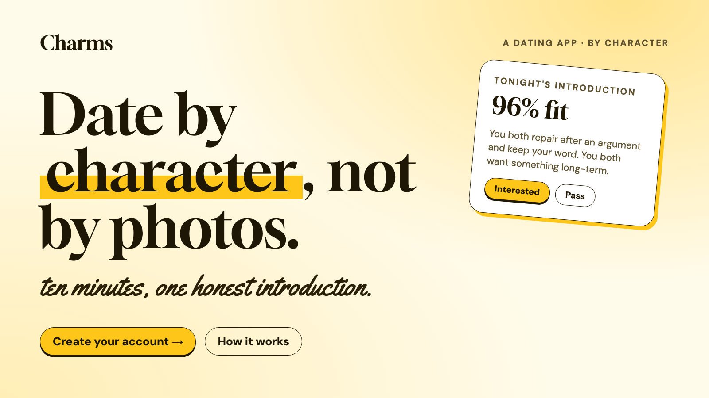
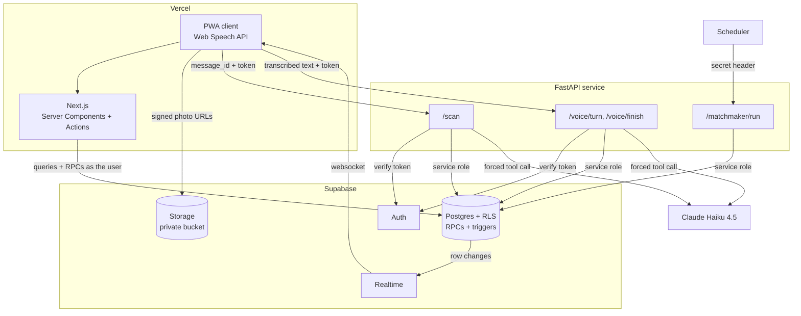
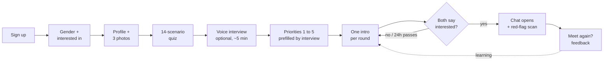
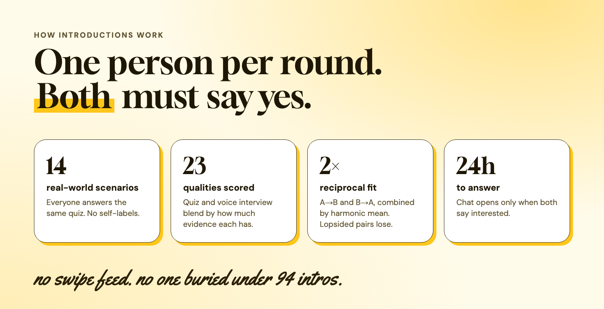
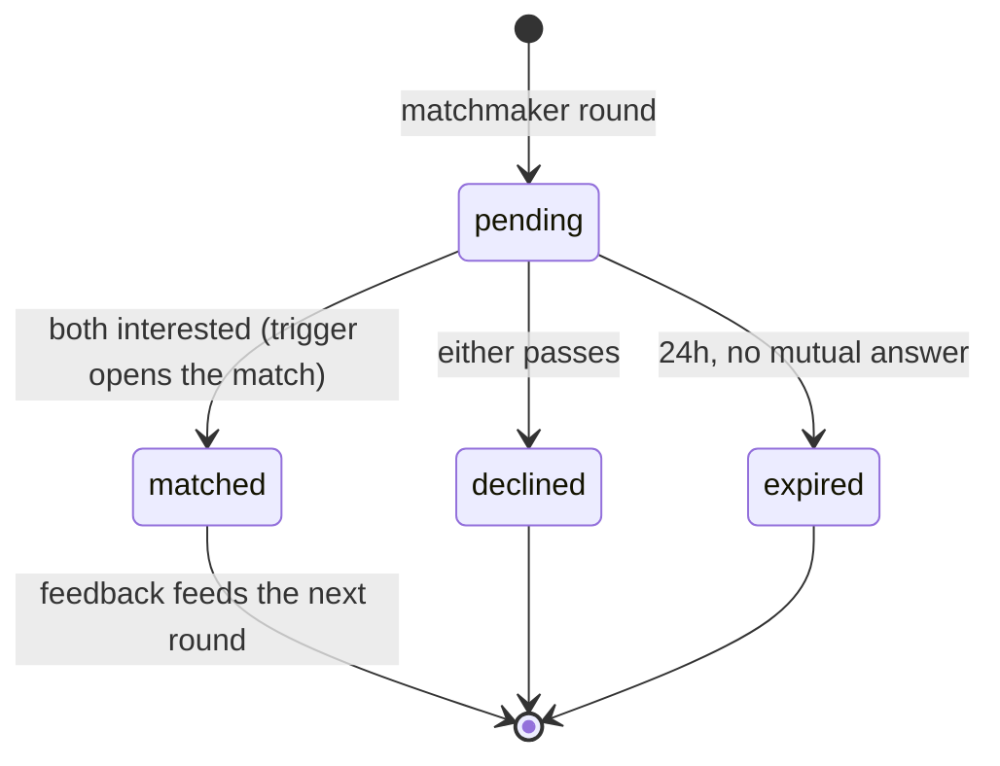
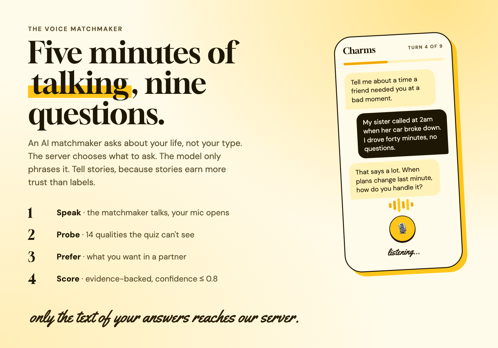
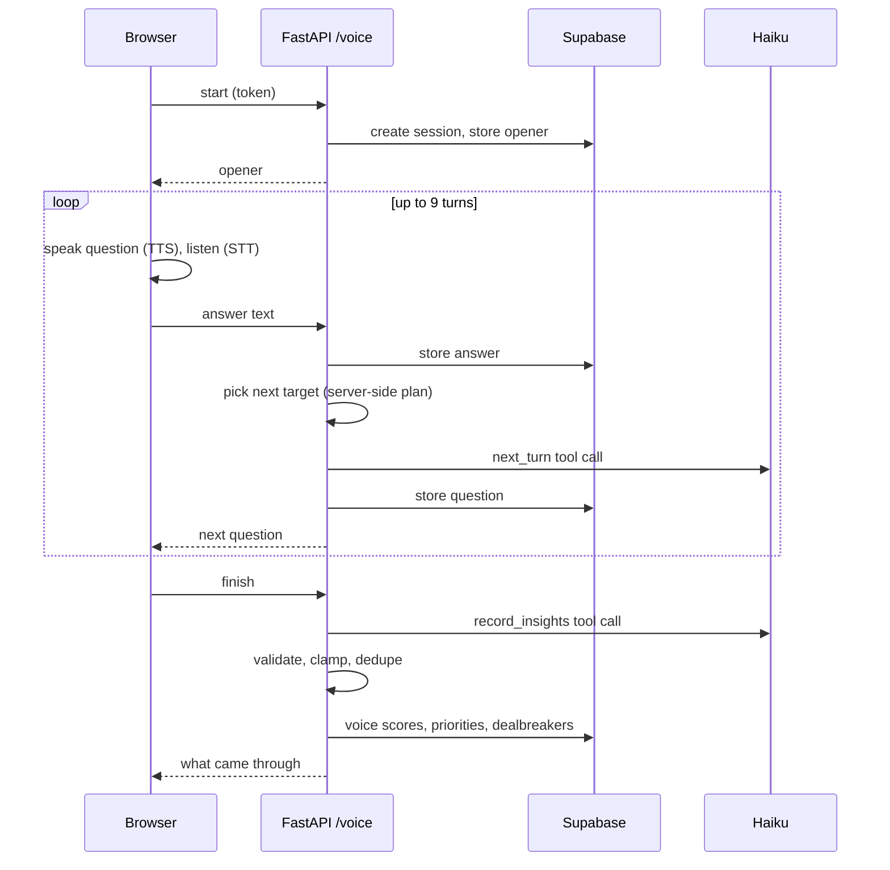
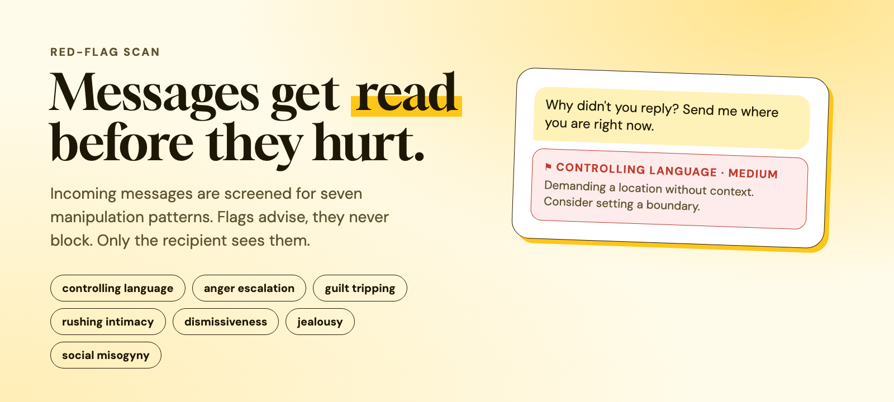
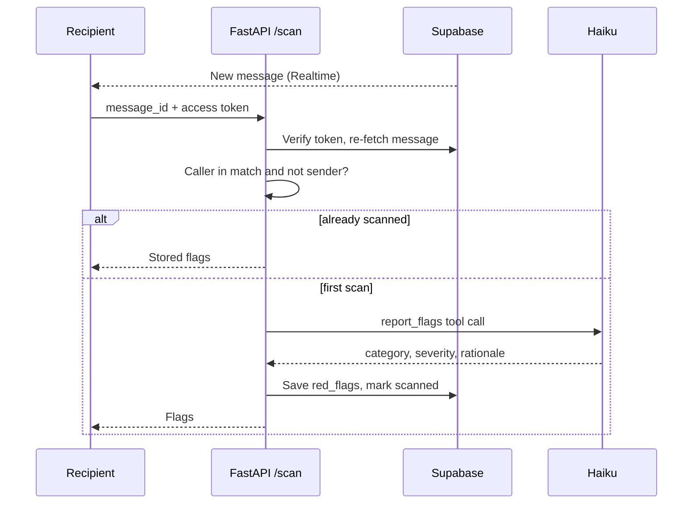
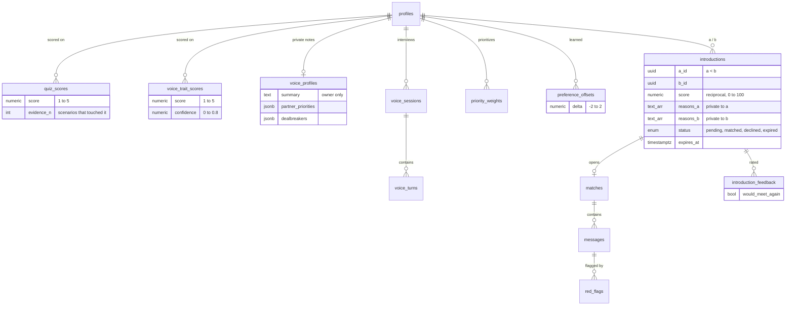

# Manter

**A dating app that introduces people by how they'd act, not how they look.** *(In-app name: Charms.)*

Everyone answers the same 14 real-world scenarios, then talks to a voice matchmaker for about five minutes. Both feed a score on 23 qualities, like respecting boundaries and conflict repair. There is no swipe feed. Each round, the matchmaker introduces every person to one other person, chosen so the fit works in both directions, and the chat only opens when both say yes. Incoming messages are screened for manipulation patterns, and any flag is shown to the recipient. It's an installable PWA for men, women, and LGBTQ+ users.



---

## Architecture



Supabase handles data, auth, and authorization (RLS). The FastAPI service is the only place holding the service-role and Anthropic keys. Speech-to-text and text-to-speech run in the browser, so no audio reaches the server.

---

## User flow



---

## Matching

The model follows [Known](https://known.com/readme): no browsing, one considered introduction at a time, mutual opt-in, a response window, and feedback that tunes the next round.



### 1. Character score

The quiz only exercises 9 of the 23 qualities. Before the voice interview, the other 14 sat at a neutral 3 for everyone, so weighting them changed nothing. Each quality's score now blends three sources by how much evidence each has (the `character_scores` view):

```
score = (1·3  +  n_quiz·quiz  +  2·conf_voice·voice) / (1 + n_quiz + 2·conf_voice)
```

`n_quiz` is how many scenarios touched the quality. `conf_voice` is the interview's confidence, capped at 0.8. A single quiz answer can't make anyone a 5/5, and one interview can't erase the quiz.

### 2. Reciprocal score

The old score was one-way: how well B fits what A wants. That ranks people A likes who may never like A back. Pairs are now scored in both directions and combined with a harmonic mean, which punishes lopsided pairs (0.9 and 0.3 give 0.45, not 0.6):

```
fit(A→B)   = Σ wᴬ·(sᴮ − 1)/4 / Σ wᴬ
score(A,B) = harmonic_mean(fit(A→B), fit(B→A)) + small shared-interests bonus
```

Hard filters come first: mutual gender interest, long-term vs short-term goals, and dealbreakers from the interview (for example, "no smokers").

### 3. One introduction per person

Each round is a matching problem. Each person's top 100 eligible pairs above `INTRO_MIN_SCORE` become edges, and greedy picks the best remaining pair until nobody is left. Pairs are never introduced twice, which is enforced in code and by a unique index. A blossom max-weight solver is available via `INTRO_METHOD=blossom`, and the eval below explains why it isn't the default.

### 4. Learning from outcomes

Each person's stated weights get a learned offset, fit by ridge regression on their own outcomes (interested or pass on intros, plus "would meet again" after a match). It shrinks toward zero, is capped at ±2, and is recomputed from scratch every round. The app shows what it learned ("you lean toward people strong in reliability").

### 5. Introduction lifecycle



Users never touch the `introductions` table. They read it through `my_introductions()` and answer through `respond_to_introduction()`, both `SECURITY DEFINER`. That keeps each side's reasons private, since B's reasons come from B's private priority weights. Neither side sees the other's answer unless both say yes.

---

## Evaluation

`server/scripts/eval_matchmaker.py` runs the real matcher against a simulated population with hidden ground truth: true traits, true preferences, per-person selectivity, and pair "chemistry" that no trait can see. The matcher sees noisy traits and noisy stated weights. Results are 300 users, 8 seeds, mean ± std:

| Policy | Mutual yes per intro | Matches / 100 users | Most intros on one person | Users reached |
|---|---|---|---|---|
| Uncapped one-way (old Discover) | 28.0% ± 4.0 | 27.6 ± 4.0 | **94.0** | 100% |
| Random valid pairs | 10.1% ± 2.5 | 5.0 ± 1.2 | 1 | 99.6% |
| One-way, first come | 11.2% ± 1.5 | 5.5 ± 0.8 | 1 | 97.5% |
| **Reciprocal, greedy (ships)** | 26.0% ± 2.6 | **12.5 ± 1.3** | 1 | 96.1% |
| Reciprocal, blossom, raw scores | 21.7% ± 3.3 | 10.8 ± 1.7 | 1 | 99.6% |
| Reciprocal, blossom, score⁸ | 27.2% ± 3.0 | 13.2 ± 1.4 | 1 | 97.5% |

What it showed:

- **Reciprocal scoring is the win.** Under the one-intro-per-person constraint, one-way ranking is barely better than random (5.5 vs 5.0 matches per 100 users). Reciprocal scoring more than doubles that (12.5).
- **Uncapped ranking isn't a real option.** It looks best on paper only because it lands 94 introductions on one person at once.
- **Blossom with raw scores loses to greedy.** Maximizing the *sum* of scores breaks up strong pairs to reach more people, but the odds of a mutual yes climb much faster than linearly with score. With a convex edge weight, blossom ties greedy. Paired on identical populations, the difference was −0.38 matches/100 (SE 0.46) at 200 users and +0.75 (SE 0.37) at 300. That isn't a consistent effect, so the simpler O(E log E) greedy ships.
- **Edge cap matters.** Capping each person at 30 candidate edges cut coverage to 81%, because less desirable people's top options all get taken. 100 restores 96%.

Headroom: the same matcher, handed ground truth it normally can't see:

| What the matcher knows | Matches / 100 users |
|---|---|
| No preferences (uniform weights) | 8.7 |
| Stated weights, observed traits (ships) | 12.5 |
| True weights, observed traits | 13.9 |
| True weights, true traits | 16.3 |

Asking for preferences is clearly worth it. Perfect preference knowledge adds about 1.4 matches per 100, and better trait measurement adds 2.4. That's why the learning loop shows no measurable gain here (−0.4 pts, std 1.0): with a handful of noisy labels per person, there's too little headroom to find. Better measurement, which is the voice interview's job, has more room. The learning loop stays because it's bounded, can be turned off (`LEARN_OFFSETS=false`), and is the only part that can catch a stated-vs-revealed gap larger than the sim assumes. It needs an online A/B before anyone should trust it.

These are results in a simulated world, and they depend on its assumptions. They're useful for ruling designs out, not for predicting real match rates.

```bash
python scripts/eval_matchmaker.py                     # defaults above, ~2.5 min
python scripts/eval_matchmaker.py --bias 1.5          # people underweight 3 qualities when asked
python scripts/eval_matchmaker.py --n 400 --seeds 10
```

---

## Voice matchmaker



The voice agent is a browser-based interview. It speaks each question with text-to-speech, opens the mic, and ends your turn after about 2 seconds of silence or when you tap Done. Typing works everywhere, including Firefox and when the mic is blocked. The client is `client/src/components/VoiceInterview.tsx`, the routes are `server/app/routers/voice.py`, and the question planner and extractor are `server/app/services/interviewer.py`.



- **The server picks what to ask about, and the model only phrases it.** The plan probes the 14 qualities the quiz misses, then partner preferences, then a wrap-up. Coverage is deterministic and tested instead of left to the model's memory.
- **Stories over self-labels.** "I'm really reliable" earns low confidence, and a specific story earns more. Confidence is capped at 0.8.
- **The server owns the transcript.** The client sends one answer at a time and can't rewrite history.
- **Everything is validated after the model returns.** Unknown qualities are dropped, numbers are clamped, duplicates collapse to the most confident, and dealbreaker values are checked against their field's options.
- **Privacy.** The transcript, evidence, and notes are owner-only and deletable from the app. Others see only the fused character score. Chrome's and Safari's speech recognition may send audio to Google or Apple, and the privacy policy says so. Typing works everywhere, including Firefox.
- **Cost limits.** 9 turns per interview, 5 interviews per user per day, 1,500 characters per answer.
- **Priorities prefill.** Whatever the person said they want in a partner pre-sets their priority sliders.

---

## Red-flag scan





Categories: `controlling_language`, `anger_escalation`, `guilt_tripping`, `rushing_intimacy`, `dismissiveness`, `jealousy_possessiveness`, `social_misogyny`. Severity is `low`, `medium`, or `high`.

---

## Data model



Existing tables (`profiles`, `quiz_answers`, `priority_weights`, `qualities`, `matches`, `messages`, `red_flags`) are unchanged apart from `quiz_scores.evidence_n`. RLS is on every table. `emergency_contacts`, `checkins`, and `reports` are in place for upcoming safety features.

---

## Key decisions

- **No chat without mutual consent.** A match only exists after both people say yes, and a database trigger creates it, so every write path behaves the same.
- **Server never trusts client text.** `/scan` takes only an ID and re-fetches the message server-side. `/voice` stores turns itself.
- **Structured output everywhere.** Every model call is a forced tool call with enum fields, then re-validated in code.
- **Idempotent jobs.** Scans run at most once per message. A matchmaker round can be re-run safely: busy people are skipped, pairs are unique, and offsets are recomputed rather than accumulated.
- **RLS as the auth layer.** Server components query as the signed-in user, and introductions go through `SECURITY DEFINER` RPCs that return only the caller's side.
- **Private photos.** Stored in a private bucket and served through 1-hour signed URLs.
- **Fail open.** If a scan fails, the message still shows. Flags advise, they don't block.
- **Measure before claiming.** Design choices in the matcher are backed by the eval, including the ones it overturned.

---

## Tech stack

| | |
|---|---|
| **Client** | Next.js 15 (App Router, Server Components, Server Actions), React 19, TypeScript, Tailwind v4, Web Speech API, PWA |
| **Backend** | Supabase: Postgres, RLS, RPCs, triggers, Auth, Realtime, Storage |
| **AI service** | FastAPI, Pydantic v2, Claude Haiku 4.5 (forced tool use), NumPy, NetworkX |
| **Testing** | pytest (matcher, interviewer, constant drift), offline simulation eval |
| **Data** | SQL schema + 16 migrations |
| **Deploy** | Vercel, Supabase, Render or Fly, plus any scheduler for matchmaker rounds |

---

## Run locally

**1. Supabase:** create a project, then run these in the SQL editor in order:

- **Fresh project:** `supabase/schema.sql`, `supabase/seed.sql`, `migrations/0015_voice_interview.sql`, `migrations/0016_introductions.sql`.
- **Existing project already through 0014:** just `0015` and `0016`. Both are safe to re-run.

`schema.sql` is the current state, not a starting point for 0001 to 0014, so don't replay the old migrations on top of it.

**2. Client:**

```bash
cd client
cp .env.example .env.local   # Supabase URL, anon key, FastAPI URL
pnpm install && pnpm dev     # http://localhost:3000
```

**3. AI service:**

```bash
cd server
python3 -m venv .venv && source .venv/bin/activate
pip install -r requirements-dev.txt
cp .env.example .env         # service-role key, ANTHROPIC_API_KEY, MATCHMAKER_SECRET
pytest                       # 32 tests
uvicorn app.main:app --reload --port 8000
```

**4. Demo data and a matchmaker round:**

```bash
python scripts/seed_profiles.py --male 3 --female 3 --lgbtq 6 --password <your-password>
python scripts/run_matchmaker.py --dry-run           # what would be introduced
python scripts/run_matchmaker.py --seed-autorespond  # write intros; seed accounts answer theirs
```

In production, point a scheduler at the endpoint:

```bash
curl -X POST "$API/matchmaker/run" -H "X-Matchmaker-Secret: $MATCHMAKER_SECRET"
```

---

## Known limits and next steps

- **Date planning.** Known books the venue and opens chat the morning of the date. Here the chat opens at match. Next: shared availability plus a venue pick near both people.
- **Calibrated edge weights.** Greedy works on a heuristic score. With real outcomes, fit P(mutual yes | pair) and match on that.
- **Matchmaker scale.** Scoring is vectorized but O(n²) in memory: each n×n matrix is 72 MB at 3,000 users. Past that: shard by city and use approximate nearest neighbors for candidate generation.
- **Trait-based limits.** Self-reported traits predict how much someone likes people in general and how liked they are, but very little of pair-specific attraction (Joel, Eastwick & Finkel, 2017). Outcome data is where real gains will come from.
- **Legacy Discover.** The swipe deck is still at `/discover` but out of the nav, and its "like" still opens a chat one-sidedly. It also inherits the 1,000-row read cap. Next: remove it, or make "like" an intro request.
- **Scans run when the recipient opens a chat**, so long threads fire one request per message. Next: scan on insert through a queue.
- **Not built yet:** date check-in with emergency contacts, ID verification, report/block UI, `/scan` rate limiting, client tests.

---

## Design

The theme is "Canary Rom-Com": a Known-style airy layout (big type, whitespace, pill buttons) in the yellow of Andie's gown from *How to Lose a Guy in 10 Days*. Tokens live in `client/src/app/globals.css`.

| Role | Value |
|---|---|
| Page / card paper | `#FFFBEA` / `#FFF2B8` |
| Sun (primary action) | `#FFC61A`, hover `#F2A900` |
| Ink | `#1F1705` |
| Headlines | Gloock, a poster serif |
| Script asides | Yellowtail |
| Body | DM Sans |

The README images are rendered from the same tokens.
